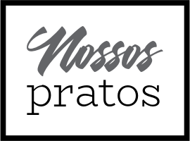

# Share Dishes

<h1 align="center">

    <br/>
   <a href="https://pt-br.reactjs.org/docs/getting-started.html" target="_blank" rel="noopener">ReactJS</a>
</h1>

## Sobre o projeto

O projeto é um desafio pessoal com o objetivo de aprimorar minhas skills, tanto de front-end quanto de back-end;

Para a utilização deste projeto, foi desenvolvida por mim uma API com Node.Js + Express e o deploy foi realizado no Heroku, uma plataforma em nuvem como serviço que suporta aplicações back-end;

Utilizei como banco de dados o Postgresql;

Este projeto é uma aplicação chamada "Share Dishes", onde será possível realizar as seguintes tarefas:

# Conta

O usuário poderá:

- Criar uma nova conta (e-mail/senha);
- Fazer login/logout.

O sistema deverá validar os dados de entrada:

- E-mail válido;
- Senha deve conter pelo menos 8 caracteres.

# Adição de dados

O usuário poderá criar registros no sistema. O registro é um prato de comida onde irá ter um nome, descrição e uma foto.
O usuário precisará estar autenticado para fazer isso.

# Listagem

Será possível listar os pratos adicionados pelos usuários e ao clicar em um item o mesmo será exibido em um modal.
O usuário precisará estar autenticado para fazer isso.

# Exclusão

Os usuários poderão excluir os pratos.
O usuário precisará estar autenticado para fazer isso.

## Tecnologias Utilizadas

- <a href="https://reactjs.org/" target="_blank" rel="noopener">ReactJs</a>

### Visualização/Utilização

- Que você tenha instalado o **<a href="https://nodejs.org/en/" target="_blank" rel="noopener">Node.js</a>**
- Que você tenha instalado o **<a href="https://www.npmjs.com/" target="_blank" rel="noopener">NPM</a>** ou o **<a href="https://yarnpkg.com/" target="_blank" rel="noopener">YARN</a>**

### Passos para utilizar

Primeiro clone o repositório em seu computador, por meio do terminal utilizando o comando:

1. Clonando o repositório

```sh
  # Clone o repositório
  $ git clone https://github.com/HumbertoF98/Share-Dishes.git
  # Entre na pasta raiz da aplicação
  $ cd Share-Dishes
```

2. Instalando dependências

```sh
  # Instale as dependências da aplicação
  $ npm install # ou yarn (caso tenha instalado)
```

4. Iniciando a aplicação

```sh
  # Inicie a aplicação web
  $ npm start # ou yarn start (caso tenha instalado)
```
